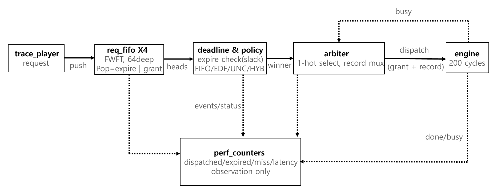

# Deadline- and Uncertainty-Aware RTL Scheduler for Selective Reinspection

An AI-based machine-vision inspection line may flag some parts as defective
even when the initial classification is uncertain. Each borderline case
becomes a **reinspection request** with a deadline and an uncertainty score.
Requests wait in one of four per-stream FIFOs, all sharing a single
reinspection engine. This synthesizable Verilog scheduler selects which
request to dispatch next, with the goal of recovering as many false rejects
as possible before their deadlines.

## Results

The scheduler implements four policies:

* **FIFO** selects the oldest request
* **EDF** selects the request with the earliest deadline
* **UNC** selects the request with the highest uncertainty
* **HYB** combines deadline urgency and uncertainty using programmable weights

Test conditions: seed 7, 300 requests, `LATENCY` = 200 cycles, and
HYB `W_D:W_U` = 3:1.

| Load | Policy | Dispatched | Expired | Deadline misses | FR recovered |
|---|---|---|---|---|---|
| normal | FIFO | 295 | 5 | 8 | 22 |
| normal | EDF | 296 | 4 | **3** | 23 |
| normal | UNC | 296 | 4 | 8 | 23 |
| normal | HYB | 296 | 4 | 7 | 23 |
| bursty | FIFO | 93 | 207 | 17 | 9 |
| bursty | EDF | 95 | 205 | 25 | 6 |
| bursty | UNC | 92 | 208 | 19 | **11** |
| bursty | HYB | 93 | 207 | 22 | 11 |
| overload | FIFO | 196 | 104 | 30 | 14 |
| overload | EDF | 196 | 104 | 58 | 13 |
| overload | UNC | 195 | 105 | **27** | **17** |
| overload | HYB | 195 | 105 | 32 | 16 |

Policy choice has little effect under normal load. Under overload, the
uncertainty-aware policies produce fewer deadline misses and recover more
false rejects than EDF.

## Analysis

### EDF under overload

EDF does not account for the known, fixed processing latency. A request
cannot finish before its deadline when `remaining slack < LATENCY`. However,
EDF still favors such requests because they have the smallest remaining
slack. Under overload, 58 of the requests EDF dispatches miss their deadlines,
while each still occupies the engine for 200 cycles.

Because the second-pass latency is fixed, a single comparator can identify
these infeasible requests.

### Feasibility gate

A feasibility-gate experiment was performed in the golden model only. A
request is dropped at the queue head when `slack < LATENCY`. This reduces
deadline misses to 0 for every policy and raises EDF's on-time completions
(dispatched minus missed) from 138 to 195 under overload. However, it also removes most of the
performance differences between the policies.

The gate is a standard admission-control mechanism, so it is reported as an
analysis result rather than a design contribution. The main policy comparison
excludes the gate to preserve a meaningful scheduling problem.

### Hybrid weight sweep

A weight sweep from W_D:W_U = 8:1 to 1:8 was performed using
`sw/sweep_weights.sh`. As W_U increases, Hybrid converges toward UNC but does
not outperform it.

1. Without feasibility filtering, deadline urgency prioritizes requests that
   can no longer finish on time. Any nonzero W_D therefore degrades overload
   performance. At 8:1, deadline misses increase to 43. The best result
   occurs at W_D = 0, which makes Hybrid equivalent to UNC.
2. Hybrid quantizes deadline slack into an 8-bit urgency value. This loses
   EDF's full-resolution deadline ordering when slack is large. Under normal
   load, EDF produces 3 deadline misses, while Hybrid produces 7 even at 8:1.
3. In the synthetic workload, false-reject probability depends only on
   uncertainty and is independent of the deadline. Deadline information
   therefore provides no additional predictive value for FR recovery.

Hybrid should be reevaluated with a feasibility gate and workloads in which
uncertainty and deadline pressure are correlated. This is left as future
work.

## Architecture



* Record format: 80 bits, `{req_id[8], uncertainty[8], deadline[32], arrival[32]}`
* Policy modes: `00` FIFO, `01` EDF, `10` UNC, `11` HYB
* Hybrid score: `score = W_D*urgency8 + W_U*u`, weights programmable at runtime
* Expiration is checked only at each FIFO head
* The reinspection engine is non-preemptive
* Each input stream uses an FWFT FIFO

## Repository layout

```
rtl/          synthesizable Verilog (top: scheduler_top)
tb/           tb_top.sv (self-checking TB + CSV logging), sva_bind.sv (A1-A5, xsim)
sw/           gen_trace.py · golden.py · compare.py · run_regress.sh · sweep_weights.sh
constraints/  timing.xdc (25 ns clock)
docs/         architecture.png
```

Trace files and simulation outputs are generated deterministically by the
scripts in `sw/` and are not committed.

## Synthesis results

Target: xc7z010clg400-1, Vivado 2022.2.

### Utilization

* 2,532 LUTs (14.4%)
* 753 flip-flops (2.1%)
* 0 BRAM, 0 DSP

The 8-bit Hybrid multipliers map to LUT logic, and the per-stream FIFOs are
inferred as distributed RAM. These figures are from the synthesis performed
before the performance-counter pipeline was added; the pipeline adds
approximately 100 snapshot registers.

### Timing

Timing closes at 40 MHz with a 25 ns clock period. Using the
`Flow_PerfOptimized_high` synthesis strategy, WNS is +0.694 ns. The synthesis
estimate implies an Fmax of approximately 41.1 MHz. With the default
synthesis strategy, timing closes at 37 MHz with a 27 ns period and WNS of
+1.137 ns.

The initial 100 MHz target was not met. Timing analysis identified two
critical paths.

**Performance-counter path.** The first critical path had WNS of -18.1 ns
and 58 logic levels. It ended at the 64-bit `sum_latency` accumulator because
the measurement logic was part of the combinational decision path.
Registering the grant-time operands and delaying the accumulation by one
cycle removed this bottleneck. This change did not affect any counter value
or the dispatch log. All 12 configurations were reverified and still match
the golden model exactly.

**Scheduling-decision path.** The remaining path is 25.7 ns long and
contains 43 logic levels:

```
FIFO head -> expire / policy / tournament -> grant -> pop pointer
```

Unlike the counter path, this one cannot be registered away: delaying the
grant delays the FIFO pop, so the next decision would be made on stale
state. Reaching 100 MHz would therefore require pipelining the grant
decision itself, which changes the scheduling semantics and is left as
future work.

**Application context.** The engine occupies 200 cycles per request. A
scheduler capable of making one decision per cycle at 40 MHz therefore
supports a decision rate more than two orders of magnitude above the
application's requirement.

## Verification methodology

### Golden-model comparison

All 12 configurations (3 workloads x 4 policies) pass against a
cycle-stepped Python golden model in Vivado 2022.2 xsim. A multi-seed
regression (6 seeds x 3 loads x 4 policies, 72 runs) also matches in every
run. The following conservation invariant holds in every run:
`pushed == dispatched + expired`.

### Pass criterion

PASS requires matching dispatch order and checked counter values. Dispatch
timestamps are compared with a three-cycle tolerance; larger differences are
reported as warnings and do not affect PASS. This keeps the reference model
usable after limited RTL pipeline changes.

The golden model reproduces the relevant RTL register stages:

* push visibility: +2 cycles
* post-pop head visibility: +1 cycle
* minimum grant-to-grant interval: LATENCY+1 cycles (busy is asserted for
  LATENCY cycles)

Although a three-cycle tolerance is allowed, all 12 runs matched cycle for
cycle with a difference of 0.

### Metrics

All counters in the results table are RTL outputs except `FR recovered`,
which is computed offline by the golden model from labels in the trace CSV.
The labels are not visible to the RTL, so this counter is not part of the
RTL-vs-golden comparison.

### Assertions

SVA assertions A1-A5 are bound to `scheduler_top`:

* A1: any nonzero grant is one-hot
* A2: a granted FIFO head is valid
* A3: no grant occurs while the engine is busy
* A4: an expired head is never granted
* A5: expire and grant never target the same head in one cycle

The testbench checks A6, the conservation property, at the end of the
simulation.

### Corner cases

Corner cases tested: empty trace, all requests expired on arrival,
simultaneous arrival on all four streams (tie-break observed as 0, 1, 2, 3),
and expiration of entries hidden behind a valid head.

## License

MIT. See [LICENSE](LICENSE).
